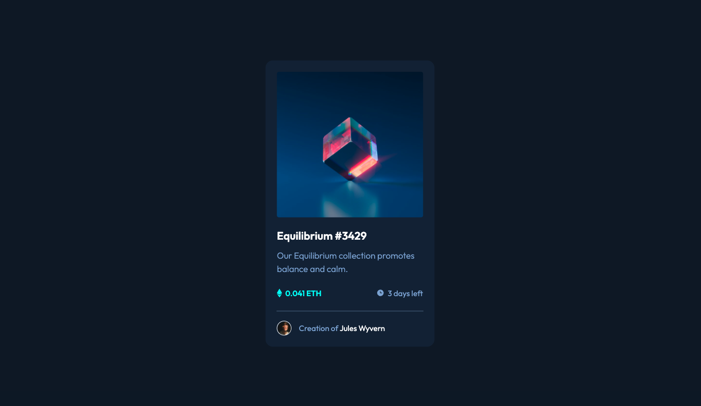

This is a solution to the [NFT preview card component challenge](https://www.frontendmentor.io/challenges/nft-preview-card-component-SbdUL_w0U).

## Table of contents

- [Overview](#overview)
  - [The challenge](#the-challenge)
  - [Screenshot](#screenshot)
  - [Links](#links)
- [My process](#my-process)
  - [Built with](#built-with)
  - [What I learned](#what-i-learned)
  - [Continued development](#continued-development)
- [Author](#author)

## Overview

### The challenge

Users should be able to:

- View the optimal layout depending on their device's screen size (mobile: 375px, desktop: 1440px)
- See hover states for interactive elements

### Screenshot




### Links

- Solution URL: [Frontend Mentor Solution](https://www.frontendmentor.io/solutions/nft-preview-card-FcCCRfRC6h)
- Live Site URL: [Vercel Solution](https://nft-preview-card-flax-five.vercel.app/)

## My process

### Built with

- Semantic HTML5 markup
- CSS custom properties
- Flexbox
- Mobile-first workflow


### What I learned

To complete this challenge I had to use HTML and CSS to make the final result as close as possible to the original.

Getting the exact amount of margin and padding right took me some time, but the most difficult part was the active state when hoovering over the image (NFT). For this, I had to play with the z-index and the opacity of the elements involved. This is how I achieved this:

```html
<div class="nft-image-container">
  
  <div class="nft-image-background"></div>
  
</div>
```
```css
.main-card {
  align-items: center;
  background-color: #14253d;
  background-color: hsl(216, 50%, 16%);
  border-radius: 15px;
  display: flex;
  flex-flow: column nowrap;
  padding: var(--margin-top) auto;
  position: relative;
  max-width: 80%;
}
.nft-image-container {
  align-items: center;
  display: flex;
  height: 100%;
  justify-content: center;
  margin-bottom: var(--margin-bottom);
  position: relative;
  width: 100%;
}
.icon-view {
  display: block;
  position: absolute;
  z-index: 3;
}
.nft-image-background {
  background-color: rgb(0, 255, 247);
  background-color: hsl(178, 100%, 50%);
  border-radius: 5px;
  height: 100%;
  opacity: 0;
  position: absolute;
  width: 100%;
  z-index: 2;
}
.nft-image {
  border-radius: 5px;
  max-width: 100%;
  z-index: 4;
}
.nft-image-container:hover {
  cursor: pointer;
}
.nft-image-container:hover .nft-image {
  z-index: 1;
}
.nft-image-container:hover .nft-image-background {
  opacity: 50%;
}
```

Overall, it has been a simple but entertaining project that has allowed me to create an elegant and simple component.


### Continued development

I think I can improve further by learning more about how to manipulate images and the position of elements.


## Author

- Website - [My Coding Projects](mycodingprojects.co.uk)
- Frontend Mentor - [@Stigmavlc](https://www.frontendmentor.io/profile/yourusername)
